# Моя раскладка

Целевая раскладка на 34 клавишы

Для перепроживки:

- подключить USB-c к компьютеру;
- нажать два раза на кнопку рядом с переключателем - плата должна появиться как носитель на ПК;
- перетаскиваем прошивку нужной половинки на носитель - при успехе плата сама размонтируется;
- повторяем со второй половинкой.

## Слои

0. Основной слой (base layer) -> переход на Навигационный 1 или символьный 2
   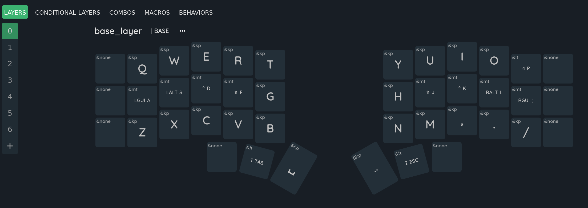

1. Навигационный + цифровой -> переход на Управление 3 или Символьный 2
   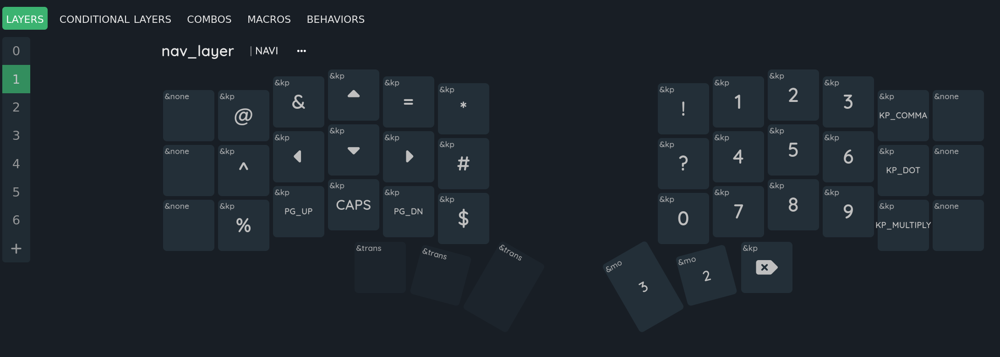

2. Символьный (мультимедия + Unicode)

Примерная карта символов Unicode на левой половинке (работают в linux, для других систем нужно перенастраивать)
| 1 | 2 | 3 | 4 | 5 | 6 | | 7 | 8 | 9 | 10 | 11 | 12 |
| ------- | ------- | ------- | ------- | ------- | ------- | ------- | ------- | ------- | ------- | ------- | ------- | - |
| | | | ° | ≠ | × | | ... | ... | ... | ... | ... | |
| | | « | — | » | | | C_Mute | ... | ... | ... | ... | |
| | | | | | ∞| | PrintScreen | ... | ... | ... | ... | ... | |

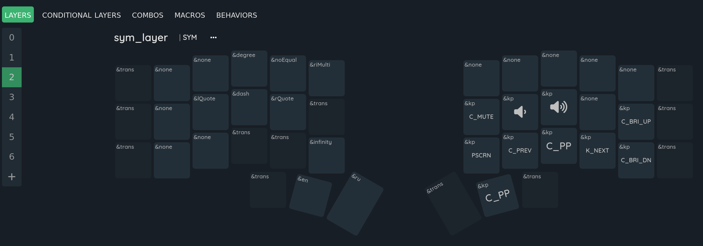

3. Слой управления -> toggle переход на Игровой

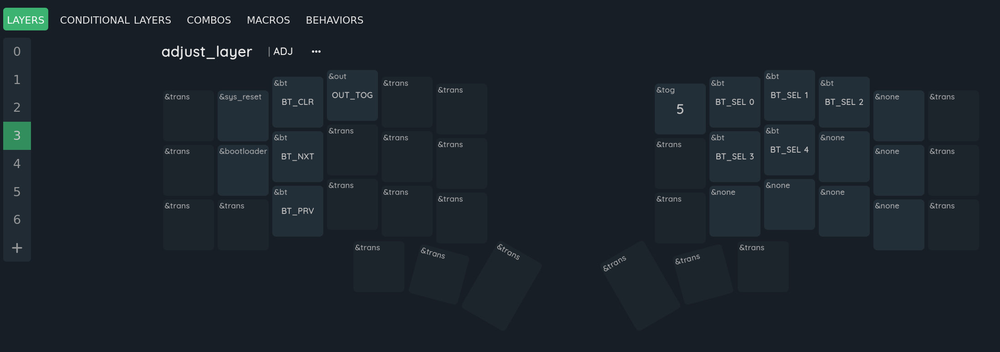

4. Функциональный (F-клавишы)

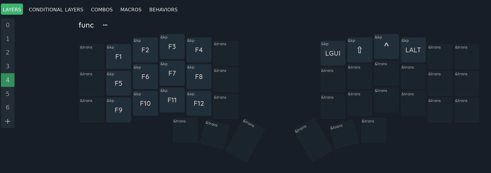

5. Игровой

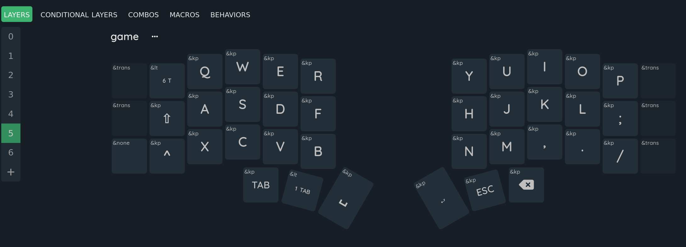

6. Поддержка в играх

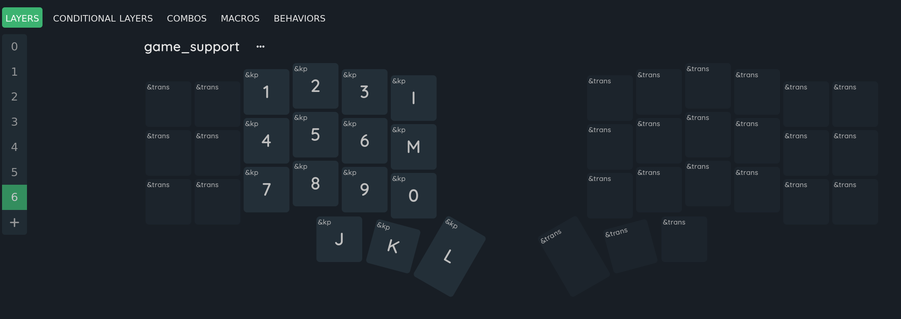

## Комбо

Комбо нужны для символов преимущественно. Есть комбо на три клавишы на левой и три на правой половинке под Enter и Backspace соответственно.

Примерная карта combo:

| 1+2 | 2+3 | 3+4 | 4+5 |     | 8+9 | 9+10 | 10+11 | 11+12 |
| --- | --- | --- | --- | --- | --- | ---- | ----- | ----- |
|     | +   | -   | (   |     | )   | \_   | \|    |       |
|     | `   | "   | [   |     | ]   | '    | ~     |       |
|     |     | <   | {   |     | }   | >    |       |       |

Delete работает как backspace в Символьном 2 слое.

Расишфровка макросов Unicode для Символьного 2 слоя

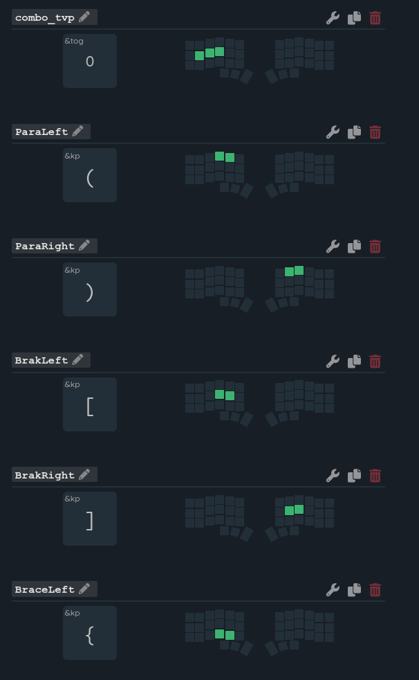

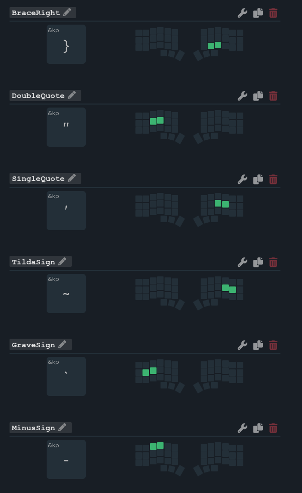

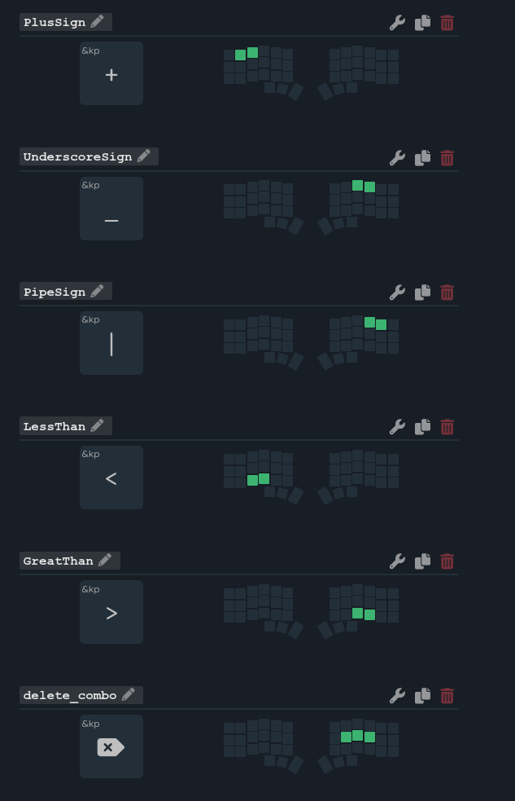

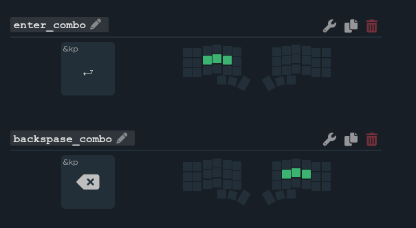

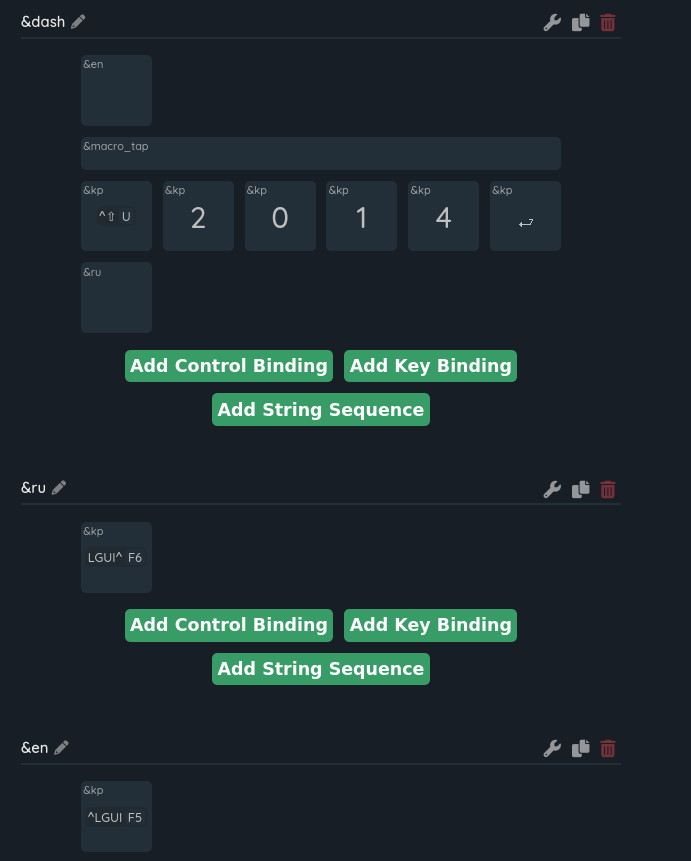

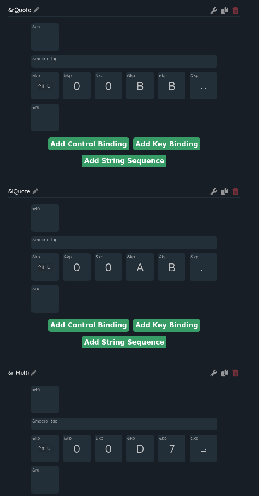

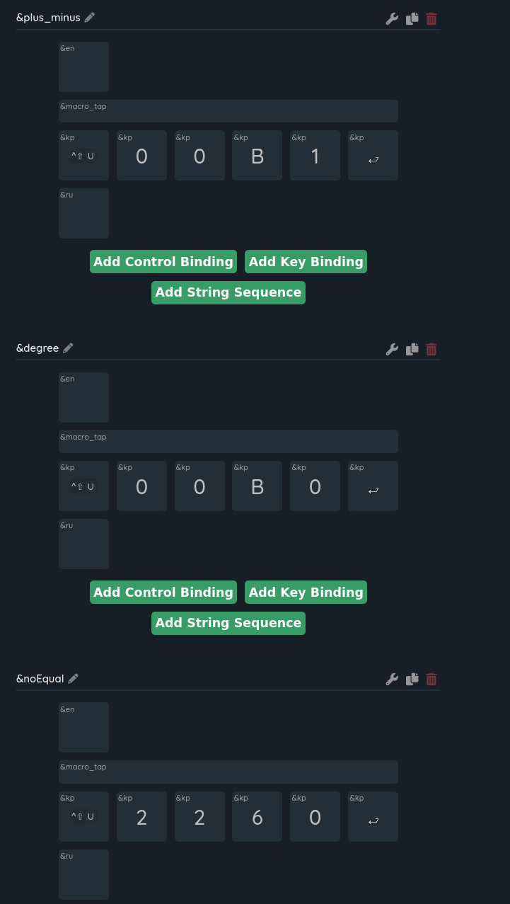

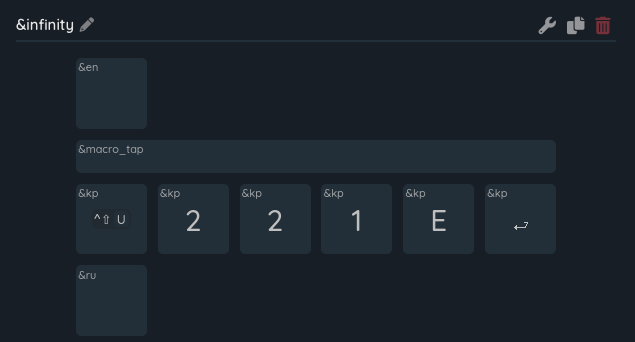

# Corne-zmk-studio

Скачиваем ZMK Studio и устанавливаем:

https://github.com/zmkfirmware/zmk-studio/releases

ИЛИ

Используем online keymap-editor. Все что надо - авторизация через Github и предоставление прав на работу с репозиторием

https://nickcoutsos.github.io/keymap-editor/

## Layout

Раскладку можно увидеть через keymap-editor или zmk-studio, частично - в комментариях конфигурации. Является имплементацией моей раскладки на 36 клавиш для [Totem](github.com/DenHax/zmk-config-totem)

Макросы, установленные в corne.keymap, работают преимущественно в Linux: два макроса на статическое переключение языка, остальные макросы на ввод unicoe символов, таких как °, ≠, «, —, », ∞.

Переключение языков работает только если макрос будет распознан в операционной системе или графическом окружении.

## ZMK

Во-первых, сама по себе правая работать по дефолту не должна. С хостом она общается только через левую.

Во-вторых, между заливами на контроллер прошивок от разных половин нужно шить ресет. Иначе происходит пижня с блютусом, они отказываются спариваться.

В-третьих, сейчас процедура: залил на обе ресет, залил на левую левую, а на правую правую, ресетнул вместе (в течение полсекунды). Должны соединиться, по USB от левой будут приходить клавиши от обоих.

левая половинка главная.
т.е. правая коннектится к левой, а левая к компу. это соответственно влияет и на время работы аккума. левая около недели, правая около 3.

основные доки по прошивке тут:

https://zmk.dev/

включение - переключатели должны быть во внутрь на обеих половинках направлены (т.е. зеркально) - направление помечено зеленым :)
для спаривания с компом на моей прошивке - нажать одновременно красные кнопки, а синие отвечают за порядковый номер подключения. (клавиатура может быть сопряжена с несколькими компами и переключаться между ними по нажатию)
желтое - разблокировать клавиатуру для визуального интерфейса zmk-studio

вот это самое важное, редактирование расположения кнопок
сверху - это просто ни на что не влияющий визуал, чтобы удобнее читать было и красивишно оформлено

а касательно раскладки и компановки кнопок в прошивке - у вотчмена есть отличные пресеты, с которых можно начать. они на базе qwerty

https://github.com/aroum/Watchman-layouts

По сути все просто
Редачишь файлик с нужными кодами и их actions забираешь архив с прошивкой через пару минут из вкладки Actions

-

для проводного варианта:

контроллеры Pro Micro ATmega32U4- https://sl.aliexpress.ru/p?key=WmPYGmC

инструкция - https://likipiki.gitlab.io/posts/jornebuild/

прошивка - https://likipiki.gitlab.io/posts/qmkbuild/
